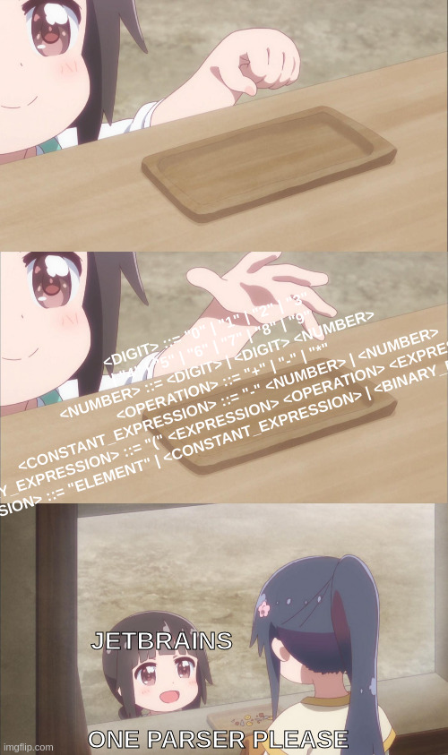

# Toy-parser

This is a toy parser made as the solution to a jetbrains test task.
The grammar is defined in the `grammar` file inside the `src/main/resources` folder.

### Thought process and design decisions

I'm not going to lie, it was the first time laying my eyes on Backus Naur Form grammar, so I had to do some research on it.

Once I understood what the grammar meant, I started playing with it on online BNF parsers to test for edge cases and see how it behaves.
As it turns out, the only things that were odd to me were the lack of spaces `" "` and the `"element"` terminal to represent an expression. Was it intended ?

Looking online courses about parsers, I stumbled upon a video about recursive descent parsers, which was easy enough for me to implement.
There are other parsers, like the `LL(1/N)` parsers, but I didn't have the time to learn them.

At first, I implemented a generic `Node` class that could have other children nodes.
Each non-terminal would have its own function consuming the input and returning a node.

Then I wanted to get back a string representation from my parsed tree, so I implemented the `print()` method and implemented specialized classes for each (non-)terminal.
After that, I fluffed up the error handling by creating different `ParserException` (sub)classes.

Feeling confident, I added some tests to check if the parser was working as expected.

It wasn't. I forgot some basic out of bounds checks and the parser was throwing exceptions that were not controlled.
I fixed that and added some more tests to cover all cases I could think of.

### Final thoughts
This was a fun small scale program to work on.
All the tests I'm passing for jetbrains applications are putting me in a slightly unknown territory, which is entertaining.

For sure, a few things could be improved.
From what I understand, I should turn every terminal into a token to make it easier to post process the parsed tree.
I could also add a lexer to separate the tokenization from the parsing. I am not at this level yet, I'll probably take a look at it for future projects though.

I also have the feeling the structure of the parsed tree could be improved, for example the grammar states that a `<number>` is one of more `<digit>` but each subsequent digit is encapsulated by a `<number>` node.
That's exactly what the grammar asks for though.

